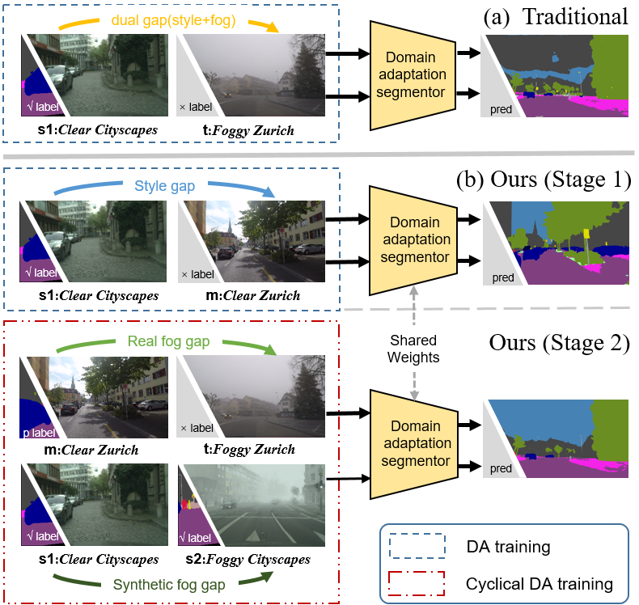

# CumFormer：基于逐步域间差距解耦的雾天场景语义分割

> CumFormer提出了一种创新的域适应方法，通过逐步解耦域间差距来实现雾天场景的精确语义分割。该方法引入中间域，将源域到目标域的适应过程分解为两个阶段，分别处理风格差异和雾气退化问题，显著提高了模型在复杂天气条件下的分割性能。
> 
> 可访问 [作品主页](https://lbw15507.github.io/CumFormer/README.html)。
## 技术背景与挑战

在自动驾驶和视觉导航领域，准确的语义雾景分割（SFSS）对于系统的安全性至关重要。然而，雾气导致的图像模糊和高标注成本，使得在雾天条件下进行语义分割成为一个重大挑战：

- **图像模糊与标注难度**：雾气引起的模糊增加了识别关键目标的难度，并提高了语义模糊和混淆的风险。
- **高标注成本**：在恶劣天气下，逐像素分割标注比清晰场景更费时费力，导致使用传统全监督方法的成本较高。
- **大域间差距**：不同城市风格和雾天视觉退化使得源域（清晰场景）和目标域（雾天场景）之间存在显著的差距，阻碍了领域自适应的有效性。

为了克服这些挑战，CumFormer通过逐步解耦域间差距，显著提高了雾天场景的语义分割性能。

## 结构概览

- **configs**: 包含各种域适应配置文件，涵盖数据增强和迁移学习策略。
- **demo**: 提供实际应用示例，演示域适应图像分割的实现。
- **learn**: 包含学习和实验相关的脚本。
- **mmseg**: 框架的核心模块，涵盖 API、数据集处理、模型定义等。
- **pretrained**: 存放预训练模型和提示信息。
- **tools**: 包括数据集转换、度量学习、测试时增强 (TTA) 等实用工具。

## 核心功能

- **域适应图像分割**: 解决不同域间的图像分割问题，采用无监督、半监督和自监督学习策略。
- **强大的数据处理**: 支持广泛的数据处理和增强技术，提升模型在新域的表现。

## 安装说明

1. 克隆本仓库到本地。
2. 修改 `configs` 目录下的配置文件，以符合具体的应用需求。
3. 运行 `demo` 目录下的示例脚本，观察不同域适应策略的效果。

## 方法介绍

CumFormer通过分阶段的域适应过程，将跨域任务分解为两个关键阶段：

1. **风格适应**  
   - 从清晰场景（源域）到不同风格但清晰的场景（中间域）的适应。
   - 主要解决不同城市风格间的差异问题。

2. **雾气适应**  
   - 从中间域（清晰场景）到目标域（雾天场景）的适应。
   - 处理因雾气导致的视觉退化问题。

### 技术细节

#### 标签参考值（Label Reference Value）

标签参考值用于量化自训练过程中源域标签对目标域伪标签的指导作用。标签参考值的高低决定了自训练的有效性：

$$q^d_C = \frac{\sum_{j=1}^{H \times W} \left[ \max_{c'} T(X^d_C)^{(j, c')} \geq \tau \right]}{H \times W}$$

通过计算目标域伪标签的置信度，可以有效评估自训练的进展和效果。

#### 分阶段自训练策略

CumFormer的核心是分阶段自训练策略：

- **第一阶段**：处理源域与中间域的风格差距。使用基础分割网络（如SegFormer）进行训练，在较小的域间差距下提高标签参考值。
- **第二阶段**：处理中间域与目标域之间的雾气差距。使用合成雾图像逐步引入真实雾天图像，自训练策略进一步增强模型的目标域性能。

混合损失的计算如下：

$$L = (1-M) \odot L^d_C + M \odot L^i_S$$

通过平衡源域和目标域损失，逐步提升模型在不同域间的适应能力。

### 实验结果与分析

我们在ACDC和Foggy Zurich-test (FZ) 数据集上验证了CumFormer的有效性。实验结果显示，CumFormer在这两个数据集上均显著优于现有方法。

| Experiment   | Method        | Backbone   | ACDC  | FZ    |
|--------------|---------------|------------|-------|-------|
| Backbone     | -             | DeepLabv2  | 33.5  | 25.9  |
|              | -             | RefineNet  | 46.4  | 34.6  |
|              | -             | SegFormer  | 47.3  | 37.7  |
| Dehazing     | DCPDN         | DeepLabv2  | 33.4  | 28.7  |
|              | MSCNN         | RefineNet  | 38.5  | 34.4  |
|              | DCP           | RefineNet  | 34.7  | 31.2  |
|              | Non-local     | RefineNet  | 31.9  | 27.6  |
|              | TransWeather  | SegFormer  | 39.4  | 37.3  |
|              | GFN           | RefineNet  | 33.6  | 28.7  |
| Synthetic    | SFSU          | RefineNet  | 45.6  | 35.7  |
|              | CMAda         | RefineNet  | 51.1  | 46.8  |
|              | FIFO          | RefineNet  | 54.1  | 48.4  |
| DA-based     | LSGAN         | DeepLabv2  | 29.3  | 24.4  |
|              | Multi-task    | DeepLabv2  | 35.4  | 28.2  |
|              | AdaptSegNet   | DeepLabv2  | 31.8  | 26.1  |
|              | ADVENT        | DeepLabv2  | 32.9  | 24.5  |
|              | CLAN          | DeepLabv2  | 38.9  | 28.3  |
|              | BDL           | DeepLabv2  | 37.7  | 30.2  |
|              | FDA           | DeepLabv2  | 39.5  | 22.2  |
|              | DISE          | DeepLabv2  | 42.3  | 40.7  |
|              | ProDA         | DeepLabv2  | 38.4  | 37.8  |
|              | DACS          | DeepLabv2  | 41.3  | 28.7  |
|              | DAFormer      | SegFormer  | 48.9  | 44.4  |
|              | CuDA-Net      | DeepLabv2  | 55.6  | 49.1  |
| **Ours**     | CumFormer     | SegFormer  | **60.7** | **54.8** |

*性能对比表：在ACDC和Foggy Zurich-test (FZ)数据集上，CumFormer的表现显著优于其他方法（以平均交并比mIoU %衡量）。*

- 标签参考值与域间差距的变化关系图，展示了不同域间差距下标签参考值的趋势。随着域间差距的减小，标签参考值显著提高，增强了自训练效果。

#### 更多实验结果

在其他不利天气条件（如雨天和雪天）下，CumFormer依然表现出了卓越的泛化能力，表明其在多种复杂场景中的应用潜力。

## 贡献与总结

1. **逐步域间差距解耦策略**：通过引入中间域，我们将跨域问题分解为多个可控的小任务，显著提高了语义分割性能。
2. **优化自训练机制**：通过引入标签参考值，我们的自训练策略更加鲁棒，在多个基准测试中均取得了领先的性能。
3. **强泛化性**：CumFormer在多种恶劣天气条件下均表现良好，具有广泛的应用前景。

CumFormer通过这些创新为未来研究提供了一种新的解决思路，有望在更多视觉任务中得到应用和扩展。